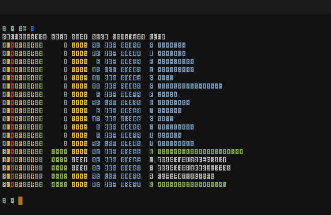
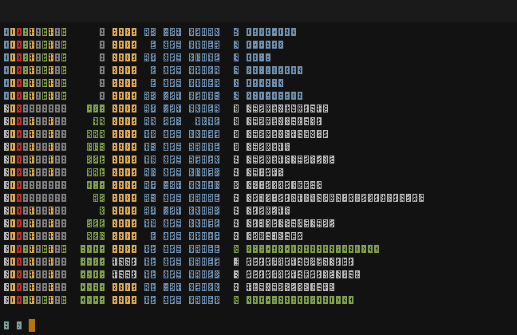
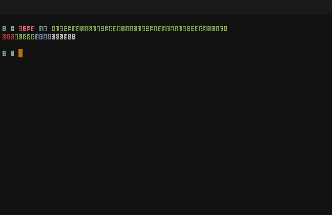

# Termspace Visual Test Screenshots

Automated screenshots from termspace's test suite. Each image is CPU-rendered from a real terminal PTY — no GPU required.

## `ls ~`

## `ls -la ~`

## ANSI Colors

---

Generated by `cargo test -p termspace-test-harness screenshot`
